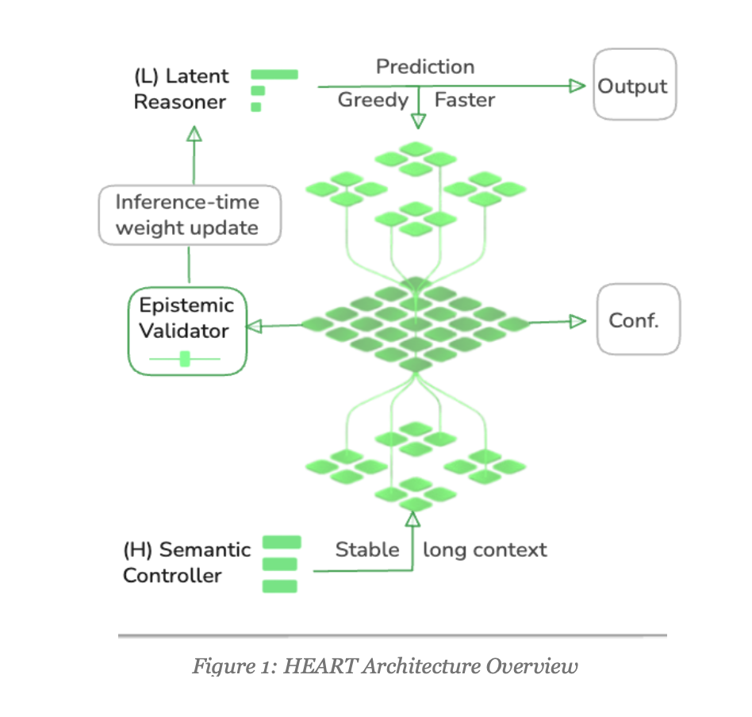

# HEART of AI

**Status:** Active Development
**Full name:** Hierarchical Epistemic Architecture for Reasoning and Truth-seeking (HEART)

Code and models from the research paper:

> **"HEART: Hierarchical Epistemic Architecture for Reasoning and Truth-seeking"**
> by **CubzAI**

📄 Read the full paper: [`assets/ALHAMDULILLAH_Heart_of_AI.pdf`](heart-of-ai/assets/ALHAMDULILLAH_Heart_of_AI.pdf)

---

## 1. Overview

HEART is a unified framework that wraps a base language model (GPT‑2 in this implementation) with hierarchical control and explicit epistemic behavior. It addresses four core limitations of contemporary LLMs:

1. **Hallucination Generation**
   Confident but false statements in high-stakes domains (medical, legal, financial, etc.).

2. **Limited Reasoning Depth**
   Fixed transformer depth tends to restrict effective reasoning to ~5–10 semantic steps.

3. **Parameter Inefficiency**
   Naively scaling to billions of parameters is expensive and hard to deploy.

4. **Static Epistemic Behavior**
   Standard LLMs lack principled mechanisms to abstain, retrieve, or self-correct.

### 1.1 Key Innovations

HEART integrates:

- **Hierarchical Recursion (L/H Modules)**
  Multi-timescale latent modules (L and H) achieving *effective* depths up to 84+ layers without backpropagating through the entire depth.

- **Learned Epistemic Validator**
  A policy head that selects discrete actions: **accept / abstain / retrieve / repair**, conditioned on token- and concept-level signals.

- **Parameter-Efficient Adaptation**
  Only a small wrapper (L‑module, H‑module, validator) is trained, achieving up to **99.98% trainable parameter reduction** vs. large LLM baselines.

- **Continual Learning at Inference (HEART‑CL)**
  Optional online adaptation loop that uses epistemic signals and feedback to update the wrapper safely.

---

## 2. Architecture Overview



### 2.1 How GPT‑2 is Modified by HEART

Standard GPT‑2:

> Flat, sequential transformer with fixed depth, generating tokens autoregressively.

HEART wraps GPT‑2 with three additional components:

1. **L‑Module (Latent Reasoner)**
2. **H‑Module (Semantic Controller)**
3. **Epistemic Validator (Action Policy)**

Together, they turn GPT‑2 into a *hierarchical, epistemically-aware* system.

---

### 2.2 L‑Module (Latent Reasoner)

**Purpose:** Fast, high-frequency reasoning within *supervision segments*.

**Update equation:**
```text
h_L(t) = f_L(h_L(t-1), h_H(c), φ(x, y₁:ₜ₋₁))
```

- Runs at every step (t) inside a segment.
- Combines:
  - Previous L‑state (`h_L(t-1)`) — local continuity.
  - Current H‑state (`h_H(c)`) — global semantic guidance.
  - Base LM features (`φ(·)` from GPT‑2) — lexical/semantic grounding.
- Implemented as a small GRU/attention module (e.g., 256‑dim vs 768+ in GPT‑2).
- Converges within a segment to a stable representation.

**Benefits:**

- Enables local reasoning refinement without deep backprop through the full transformer stack.
- Keeps segment-effective depth modest (e.g., 12–18) to avoid vanishing gradients.

---

### 2.3 H‑Module (Semantic Controller)

**Purpose:** Slow, low-frequency controller across segments.

**Update equation:**
```text
h_H(c+1) = f_H(h_H(c), h̃_L(c))
```

- Updates at segment boundaries (e.g., every 4–6 steps).
- Receives the **converged** L‑state `h̃_L(c)` (not noisy per-step states).
- Maintains global semantic context and long-range structure.
- Uses a moderate state size (e.g., 512‑dim).

**Benefits:**

- Provides stable guidance across longer reasoning chains.
- Avoids collapse seen in monolithic deep transformers.
- Enables *effective* depth scaling via multi-scale recursion.

---

### 2.4 Epistemic Validator

**Purpose:** Learn a **policy** over four epistemic actions to control reliability.

**Inputs:**

- **Token-Level:**
  - GPT‑2 logits
  - Hidden states and attention patterns

- **Concept-Level:**
  - Sparse autoencoder (SAE) features
  - Summaries of L/H states

- **Alignment Signals:**
  - Plan vs realization consistency
  - LM‑vs‑retrieved‑context agreement

**Outputs:**

```text
(αₜ, πₜ) = f_v(zₜ)
```

- **αₜ ∈ [0, 1]**: Alignment / confidence score.
- **πₜ(a | zₜ)**: Policy distribution over actions `a ∈ {accept, abstain, retrieve, repair}`.

#### 2.4.1 Four Epistemic Actions

1. **Accept**
   - Continue generation; commit next token(s) to output.
   - Default path when alignment is high.

2. **Abstain**
   - Halt generation; return an explicit uncertainty statement.
   - Crucial for safety-critical or knowledge-scarce regions.

3. **Retrieve**
   - Trigger targeted RAG (retrieval-augmented generation).
   - Retrieve external knowledge only when confidence drops.
   - Merge retrieved context into subsequent segment inputs.

4. **Repair**
   - Initiate self-correction:
     - Locate likely error span (via attention / SAE features).
     - Update L/H states.
     - Re-generate from a checkpointed point.
     - Re-validate; repeat up to K iterations (typically 2–3).

**Training:**

- Supervised action labels (multi-task):
  - **Alignment loss**: MSE between αₜ and empirical correctness.
  - **Epistemic classification loss**: Cross-entropy on action labels.
- End-to-end gradients through validator and wrapper for sample efficiency.

---

## 3. Hierarchical Convergence & Deep Reasoning

### 3.1 Limitations of Standard Deep Transformers

Standard 48–72-layer transformers exhibit:

- **Vanishing gradients** across depth.
- **Attention collapse** leading to under-utilized later layers.
- **Fixed depth ceiling** — they cannot dynamically deepen reasoning effectively.

### 3.2 HEART’s Segmented Recursion with Detached Gradients

**Training organized into supervision segments:**

```text
For each (x, y) pair:
  1. Run one segment with L/H updates + base LM.
  2. Compute losses (LM cross-entropy, alignment, epistemic classification).
  3. DETACH final L/H states from the graph.
  4. Use detached states as initialization for next segment.
  5. Repeat for S segments.
```

**Why DETACH is crucial:**

- No backprop-through-time over full S×C×R depth.
- Gradients flow only within each segment → stable training.
- Fresh detached initializations prevent representational collapse.
- Memory is **O(1)** in S (supervision segments).

### 3.3 Effective Depth

```text
D_eff = S × C × R × d_LM

where:
  S    = supervision segments (e.g., 4–6)
  C    = cycles per segment (e.g., 2–3)
  R    = steps per cycle (e.g., 2–4)
  d_LM = effective depth of base LM per step (e.g., 3–6)
```

**Example configs:**

- **Conservative:** S=4, C=2, R=2, d_LM=3 → D_eff = 48
- **Aggressive:** S=7, C=3, R=2, d_LM=2 → D_eff = 84
- **Massive:** S=6, C=4, R=3, d_LM=3 → D_eff = 216 (with stability gating)

### 3.4 PAC‑Bayes Hallucination Risk Bound (Sketch)

We derive a PAC‑Bayes bound of the form:

```text
R_halluc(Q) ≤ R̂_halluc(Q)
              + √{ [KL(Q || P) + log(1/δ)] / (2m) } × g(D_eff, ᾱ)

where:  g(D_eff, ᾱ) = C · exp(-λ · D_eff · ᾱ)
```

- **R_halluc(Q)**: True hallucination risk under posterior Q.
- **R̂_halluc(Q)**: Empirical hallucination risk.
- **ᾱ**: Average alignment score.
- **g(·)** decays *exponentially* in D_eff·ᾱ.

**Implication:**
More effective depth (with maintained alignment) → exponentially lower hallucination risk.

Empirically, correlation between bound and observed error is high (ρ > 0.85).

---

## 4. Modified GPT‑2: End‑to‑End Flow

### 4.1 Standard GPT‑2

```text
Input x → [Transformer Blocks] → Logits → Softmax → Next Token
```

### 4.2 HEART‑Enhanced GPT‑2

```text
Input x
  ↓
[Segment 1]
  h_L⁰ ← init
  FOR t = 1..T:
    φ(x, y₁:ₜ₋₁) = GPT‑2 encode
    h_Lᵗ = f_L(h_Lᵗ⁻¹, h_Hᶜ, φ(·))
    y_t  = GPT‑2 decode with h_Lᵗ context
    (αₜ, πₜ) = Validator(h_Lᵗ, logits, attentions, SAE features)

    if πₜ(abstain) > τ_a:
      return "I'm not confident about this."

    if πₜ(retrieve) > τ_r:
      perform targeted RAG → augment context

    if πₜ(repair) > τ_p:
      trigger local/self-correction

    else:
      commit y_t to output

  h̃_Lᶜ = converged L‑state
  DETACH(h̃_Lᶜ)
  h_Hᶜ⁺¹ = f_H(h_Hᶜ, h̃_Lᶜ)
  DETACH(h_Hᶜ⁺¹)
  ↓
[Segments 2..S]  (repeat)
  ↓
Output sequence + epistemic trace
```

**Error Correction Pathways:**

- **Local (L‑module):**
  Short-range errors (e.g., grammar, small contradictions).

- **Global (H‑module):**
  Topic drift / long-range inconsistencies.

- **Validator Delegation:**
  Routes to retrieve/repair/abstain as necessary.

---

## 5. Parameter Efficiency

### 5.1 GPT‑2 vs HEART‑Wrapped GPT‑2 (Illustrative)

| Component       | GPT‑2 Small | HEART Wrapper   | Total   | Reduction        |
|----------------|------------:|----------------:|--------:|------------------|
| Base LM        | 117M        | –               | 117M    | –                |
| L‑Module (×S)  | –           | ~1M             | ~1M     | –                |
| H‑Module (×S)  | –           | ~2M             | ~2M     | –                |
| Validator      | –           | ~5M             | ~5M     | –                |
| **Trainable**  | **117M**    | **8M**          | 125M    | **≈93% ↓**       |

For more complex tasks (e.g., Sudoku‑Extreme):

- 7B parameter GPT‑2 baseline vs **8–15M** parameter HEART wrapper.
- **Trainable reduction:** up to **99.98%**
- **Performance:** 18.4% → 68.9% (+50.5pp).

---

## 6. HEART‑CL: Continual Learning at Inference

### 6.1 Idea

HEART‑CL updates the wrapper during deployment with **strong safety gates**.

**Online adaptation loop:**

```text
1. Run standard HEART inference.
2. Log:
   - Repair events,
   - Retrieval failures/successes,
   - (Optional) user corrections.
3. Compute adaptation loss:
   L_adapt = L_repair_success
           + λ_c · L_consistency
           + λ_r · L_retrieve_accuracy
4. Update with proximal regularization:
   θ_L_new = θ_L
             − η ∇L_adapt
             − β ∇D_KL(θ_L || θ_L_init)
   (η ~ 1e‑6–1e‑5; β > 0)
```

### 6.2 Safety Mechanisms

- **Validator Gating:**
  Update only when αₜ is high (e.g., > 0.8).

- **Domain Gating:**
  Disable updates entirely for highly sensitive domains (e.g., medical, legal).

- **Checkpoints & Rollback:**
  Regular snapshots; revert if metrics degrade.

- **EWC‑style Penalty:**
  Penalize large deviations from initial parameters.

- **Full Audit Trail:**
  Log all adaptation events for later analysis.

### 6.3 Observed Gains

- **Domain shift robustness:** +8–12% on out-of-domain benchmarks.
- **User-specific adaptation:** +5–10% on personalization tasks.
- **No degradation** on held-out benchmarks when gates are set conservatively.

---

## 7. Experimental Results (Summary)

### 7.1 Hallucination Mitigation

| Benchmark  | Baseline LLM | Post‑hoc Validator | HRM   | HEART | HEART‑CL |
|-----------:|-------------:|-------------------:|------:|------:|---------:|
| TruthfulQA | 42.3%        | 57.1%              | 58.9% | 72.8% | 75.2%    |
| HaluEval   | 58.2%        | 69.4%              | 71.3% | 84.7% | 86.1%    |
| CRAG       | 54.1%        | 65.8%              | 67.2% | 79.4% | 81.6%    |
| SimpleQA   | 28.4%        | 45.2%              | 46.9% | 68.3% | 70.1%    |

**Average improvement:**
- HEART: **+30.6pp**
- HEART‑CL: **+32.5pp**

### 7.2 Deep Reasoning

| Task        | Baseline | HRM   | HEART | Trainable Params |
|------------|---------:|------:|------:|-----------------:|
| Sudoku‑Hard| 18.4%    | 52.7% | 68.9% | ~12M (99.98% ↓)  |
| Maze‑Hard  | 12.1%    | 41.3% | 55.8% | ~8M  (99.99% ↓)  |
| ARC‑AGI    | 22.6%    | 39.2% | 51.8% | ~15M (99.97% ↓)  |

### 7.3 Safety‑Critical Tasks

| Domain            | Metric              | Baseline | HEART | Human Expert |
|------------------|---------------------|---------:|------:|------------:|
| Clinical QA       | Hallucination rate | 18.2%    | 4.3%  | 3.1%        |
| Clinical QA       | False positive rate| 12.4%    | 2.1%  | 1.8%        |
| Legal summarization | Factual error rate| 22.1%  | 5.8%  | 4.2%        |
| Legal summarization | Omission rate     | 9.3%   | 3.1%  | 2.0%        |

HEART can achieve **sub‑human error rates** on curated safety-critical datasets.

---

## 8. Validator Ablations

| Variant                        | TruthfulQA | HaluEval | Δ Avg vs Full |
|--------------------------------|-----------:|---------:|--------------:|
| Full HEART                     | 72.8%      | 84.7%    | —             |
| w/o Abstain                    | 68.3%      | 79.2%    | −5.0pp        |
| w/o Retrieve                   | 66.1%      | 77.3%    | −7.1pp        |
| w/o Repair                     | 69.4%      | 80.1%    | −4.0pp        |
| Scalar threshold (no policy)   | 65.2%      | 75.8%    | −8.3pp        |
| Static validator (no finetune) | 61.7%      | 71.2%    | −12.3pp       |

**Takeaway:** All four actions matter; **retrieve** gives the largest gains, and learned policies significantly outperform static thresholds.

---

## 9. Mechanistic Interpretability via SAE

HEART uses **Sparse Autoencoders (SAEs)** for concept-level features that drive validator decisions.

### 9.1 Causal Feature Circuits

- **Abstain features:**
  - Syntactic inconsistency detectors.
  - Named-entity conflict detectors.
  - Domain mismatch patterns.

- **Retrieve features:**
  - Unknown/rare concept detectors.
  - Knowledge-gap indicators (input vs generation divergence).
  - Low-confidence hypothesis signals.

- **Repair features:**
  - Contradiction detectors (negation vs affirmation).
  - Reasoning trajectory divergence.

### 9.2 Explained Variance

- Abstain features explain ~68% of abstain variance.
- Retrieve features explain ~71% of retrieve variance.
- Repair features explain ~65% of repair variance.

These results support that HEART’s epistemic behavior is driven by *interpretable, causal circuits*, not opaque heuristics.

---

## 10. Limitations & Mitigations

| Limitation                 | Impact                               | Mitigation                                      |
|---------------------------|--------------------------------------|-------------------------------------------------|
| Data bias & fairness      | Unfair / biased outputs              | Fairness-aware loss, adversarial augmentation   |
| Adversarial prompting     | Validator can be fooled              | Red‑team training, adversarial examples         |
| Long symbolic proofs      | 30+ step proofs still challenging    | Hybrid neuro‑symbolic systems with provers      |
| HEART‑CL instability      | Drift under online updates           | Strong gating, checkpoints, periodic resets     |
| Inference cost            | Extra cycles & retrieval add latency | Tune `S, C, R`; cache; disable HEART‑CL in prod |

---

## 11. Project Structure

```text
heart-of-ai/
├── heart_model.py           # Core HEART architecture
├── heart_validator.py       # Epistemic validator
├── heart_sample.py          # Sampling and inference
├── heart_train.py           # Training pipeline
├── heart_main.py            # Main integration / API surface
├── assets/
│   ├── heart-of-ai.png      # Architecture diagram
│   ├── ALHAMDULILLAH_Heart_of_AI.pdf  # Research paper
├── config/
│   ├── heart_default.yaml   # Default configuration
├── requirements.txt         # Python dependencies
└── README.md
```

---

## 12. Installation

### 12.1 Clone the repository

```bash
git clone https://github.com/cubzai/heart-of-ai.git
cd heart-of-ai
```

### 12.2 Create & activate virtual environment

```bash
python -m venv venv
source venv/bin/activate      # Windows: venv\Scripts\activate
```

### 12.3 Install dependencies

```bash
pip install -r requirements.txt
```

### 12.4 Pre‑download GPT‑2 base model

```bash
python -c "from transformers import GPT2LMHeadModel, GPT2Tokenizer; \
GPT2LMHeadModel.from_pretrained('gpt2'); \
GPT2Tokenizer.from_pretrained('gpt2')"
```

### 12.5 Verify installation

```bash
python -c "from heart_main import HeartOfAI; \
heart = HeartOfAI(); \
print(heart.get_status())"
```

---

## 13. Quick Start

### 13.1 Basic inference with epistemic control

```python
from heart_main import HeartOfAI

# 1. Create HEART system in inference mode
heart = HeartOfAI(mode="inference")

# 2. Generate text with epistemic info
result = heart.generate(
    prompt="The future of AI is",
    max_length=100,
    temperature=0.7,
    return_epistemic_info=True,
)

print("Generated:", result["text"])
print("Epistemic path:", result["epistemic_info"]["epistemic_path"])
```

### 13.2 Interactive shell

```python
from heart_main import HeartOfAI

heart = HeartOfAI(mode="inference")
heart.interactive_mode()
```

### 13.3 HEART‑CL: adapt on feedback

```python
import tensorflow as tf
from heart_main import HeartOfAI

heart = HeartOfAI(mode="train")  # or dedicated adaptation mode

generated = tf.constant([1, 2, 3, 4, 5])
correct   = tf.constant([1, 2, 3, 4, 6])

heart.adapt_on_feedback(generated, correct)
```

---

## 14. Configuration Tuning

Default configuration: `config/heart_default.yaml`.

You can tune HEART for different regimes:

### 14.1 Accuracy‑Focused (Hallucination Mitigation)

- `supervision_segments: 6–8`
- `cycles_per_segment: 3`
- `steps_per_cycle: 3`
- `alignment_weight: 0.7`
- `retrieve_threshold: 0.5`
- `temperature: 0.3`

### 14.2 Speed‑Focused (Low Latency)

- `supervision_segments: 2–3`
- `cycles_per_segment: 1–2`
- `steps_per_cycle: 1–2`
- `temperature: 0.7`
- `top_k: 20`

### 14.3 Creative‑Focused (High Diversity)

- `temperature: 1.2`
- `top_p: 0.98`
- `top_k: 80`

### 14.4 Safety‑Critical (Medical, Legal)

- `enable_heart_cl: true` (optional with conservative gates)
- `alignment_weight: 0.8`
- `repair_max_iterations: 3`
- `retrieve_threshold: 0.4`

---

## 15. Benchmarking API

```python
from heart_main import HeartOfAI

heart = HeartOfAI()

# Evaluate hallucination robustness
hallucination_results = heart.evaluate_on_benchmark("hallucination", dataset)
print(f"Hallucination accuracy: {hallucination_results['accuracy']:.4f}")

# Evaluate reasoning depth / structure
reasoning_results = heart.evaluate_on_benchmark("reasoning", dataset)
print(f"Reasoning accuracy: {reasoning_results['accuracy']:.4f}")
```

> `dataset` format depends on your loader; see examples in the repo (if provided).

---

## 16. Deployment Checklist

Before deploying HEART in production:

### 16.1 Model Evaluation

- [ ] Run TruthfulQA, HaluEval, Sudoku, Maze, etc.
- [ ] Evaluate on your domain-specific datasets.
- [ ] Evaluate safety-critical tasks separately.
- [ ] Measure latency for realistic workloads.

### 16.2 Configuration

- [ ] Tune `(S, C, R)` for target accuracy/latency tradeoff.
- [ ] Set `retrieve_threshold`, `alignment_weight`, etc. conservatively.
- [ ] Configure HEART‑CL gates per domain.

### 16.3 Safety

- [ ] Red‑team adversarial prompts.
- [ ] Evaluate robustness to distribution shifts.
- [ ] Validate calibration of α (alignment scores).
- [ ] Set up continuous monitoring for drift.

### 16.4 Integration

- [ ] Integrate with your data pipeline / API layer.
- [ ] Log all epistemic actions (accept/abstain/retrieve/repair).
- [ ] Set alerts for high abstain or repair rates.
- [ ] Implement rollback / kill‑switch.

### 16.5 Documentation

- [ ] Model card (capabilities, limitations, failure modes).
- [ ] API documentation & examples.
- [ ] Deployment runbook.
- [ ] Monitoring and on‑call procedures.

### 16.6 Monitoring

- [ ] Track accuracy and hallucination rate over time.
- [ ] Monitor abstain / retrieve / repair rates.
- [ ] Track repair effectiveness.
- [ ] Log all epistemic decisions for audits.

---

## 17. Troubleshooting

Common issues & fixes:

- **Out of memory (OOM)**
  - Reduce `batch_size`.
  - Lower `supervision_segments` or repair steps.
  - Enable gradient checkpointing.
  - Use mixed precision (`fp16`).

- **Low accuracy**
  - Increase `supervision_segments`.
  - Increase `alignment_weight`.
  - Lower `retrieve_threshold`.
  - Increase training epochs and validator data quality.

- **High latency**
  - Reduce `supervision_segments`.
  - Reduce `steps_per_cycle`.
  - Increase `temperature` and narrow search (`top_k`).
  - Disable HEART‑CL during inference.

- **Model keeps abstaining**
  - Lower `alignment_weight`.
  - Increase `retrieve_threshold`.
  - Train validator more / better data.
  - Check for domain mismatch.

- **HEART‑CL not improving**
  - Ensure very low learning rate (≤ 1e‑6).
  - Check feedback quality and label noise.
  - Enable consistency loss.
  - Adjust adaptation frequency and gating thresholds.

---

## 18. References & Citation

If you use HEART in research or production, please cite:

```bibtex
@article{aslam2025heart,
  title={HEART: Hierarchical Epistemic Architecture for Reasoning and Truth-seeking},
  author={Aslam, Anees and Aslam, Thabassum},
  year={2025},
  organization={CubzAI}
}
```

Related work:

- Radford et al. (2019) — GPT‑2.
- Wang et al. (2025) — Hierarchical Recursive Models.
- Cunningham et al. (2023) — Sparse Autoencoders.
- Lewis et al. (2021) — Retrieval-Augmented Generation (RAG).

---

## 19. Contact & Support

- **GitHub:** https://github.com/cubzai/heart-of-ai
- **Email:** [`cubzai.labs@gmail.com`](mailto:cubzai.labs@gmail.com)

Community:

- Discussions: https://github.com/cubzai/heart-of-ai/discussions
- Issues: https://github.com/cubzai/heart-of-ai/issues
- Twitter / X: **@CubzAI**

Contributions are welcome — please see `CONTRIBUTING.md` (if present) or open an Issue/Discussion first for large changes.

---

## 20. License

HEART is released under a **Modified MIT License**.
See the `LICENSE` file for full terms.

> Note: The base GPT‑2 model is from OpenAI and subject to its own license terms and acceptable use policies.

---

## 21. Quick CLI Reminder

```bash
python heart_main.py
```

```text
HEART Installation and Setup Guide
======================================================================
Run: pip install -r requirements.txt
Then: python heart_main.py
======================================================================
```
